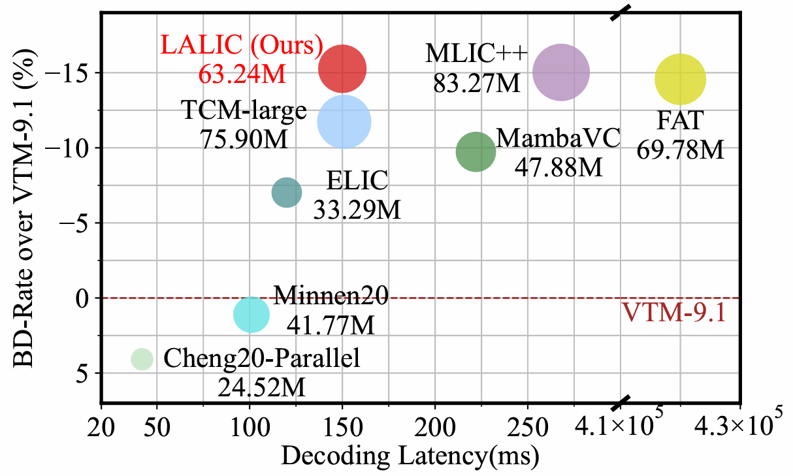
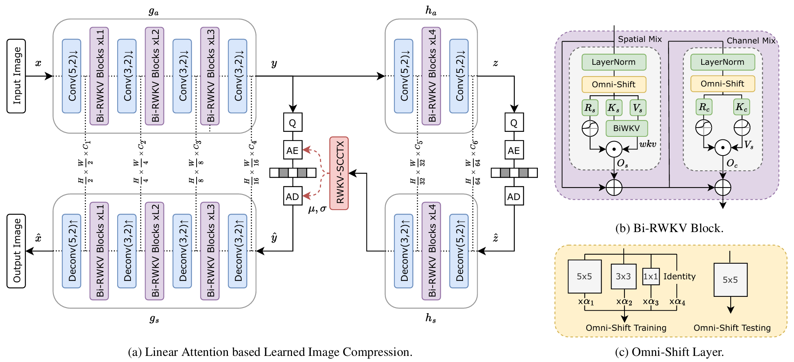
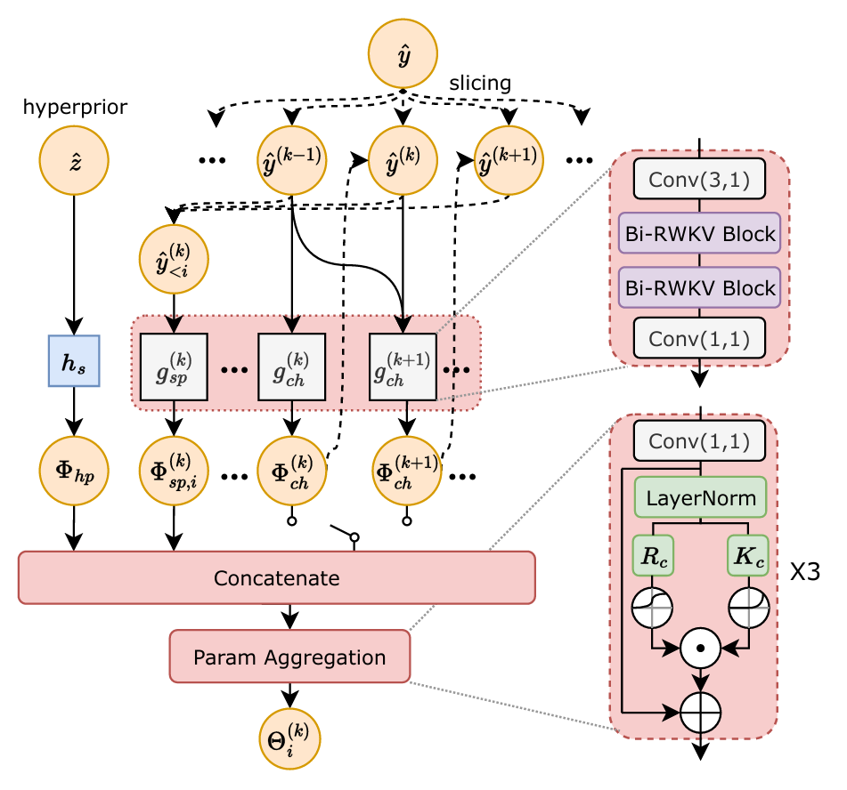
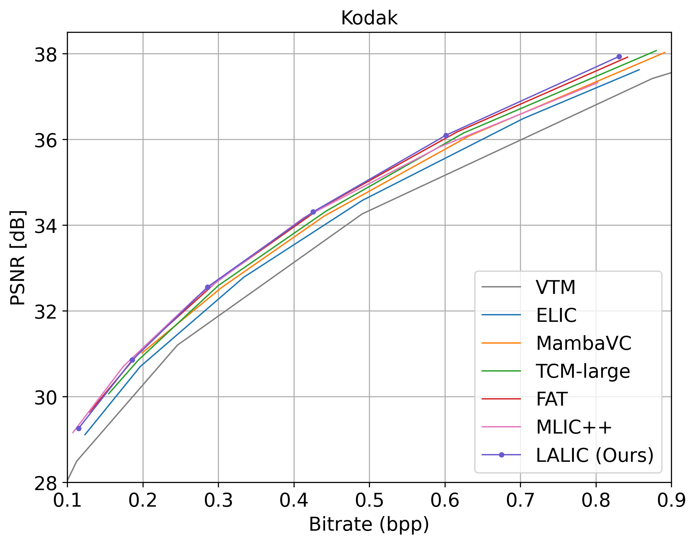
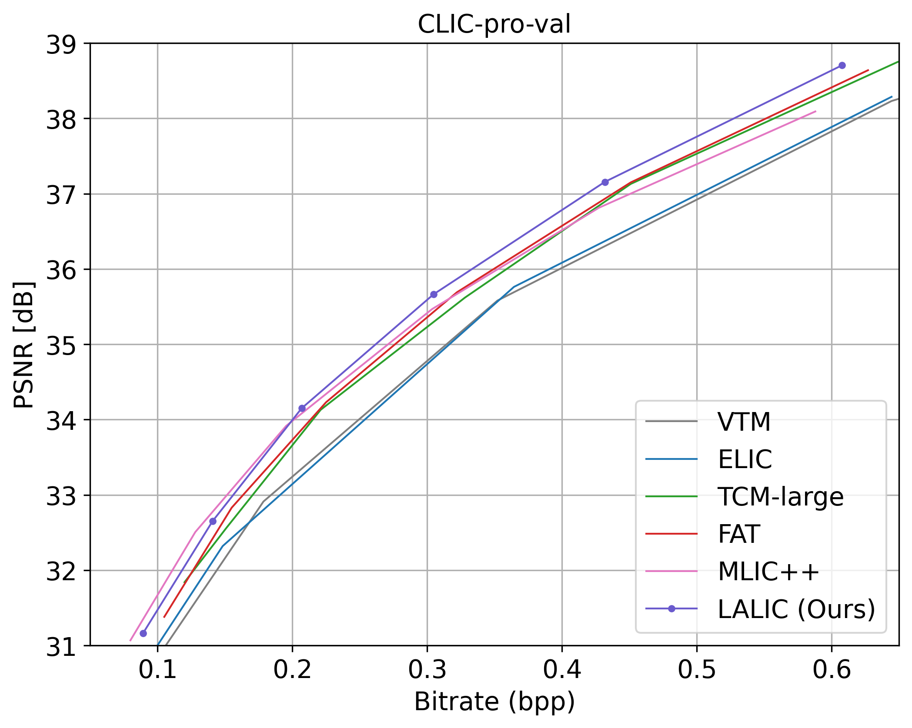
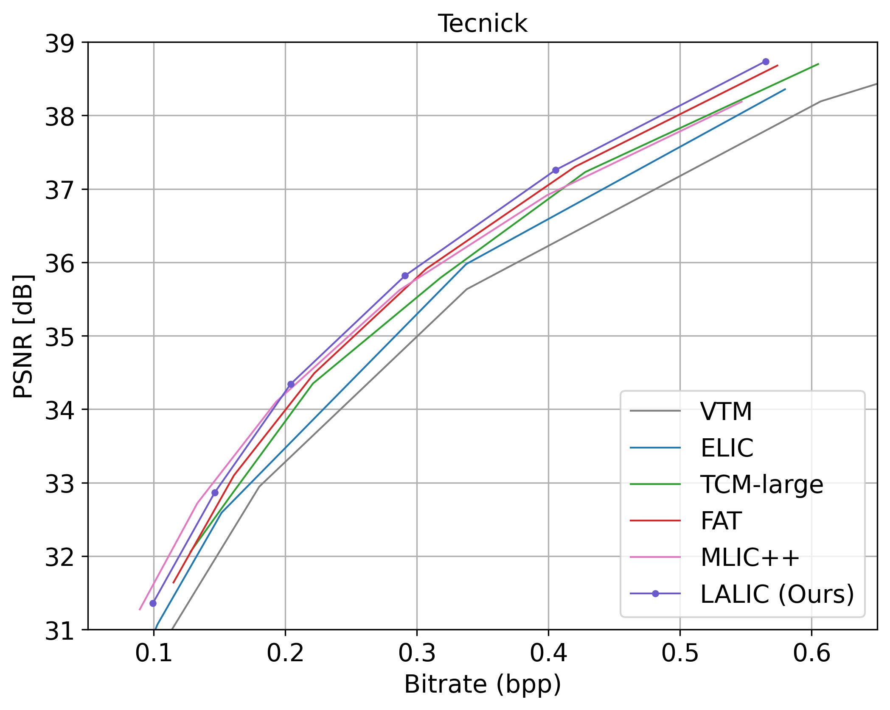

# Linear Attention Modeling for Learned Image Compression (LALIC) [CVPR 2025]

[](https://arxiv.org/abs/2502.05741)
[](https://opensource.org/licenses/MIT)

Official PyTorch implementation of the CVPR 2025 paper **"Linear Attention Modeling for Learned Image Compression"**  
*Donghui Feng, Zhengxue Cheng, Shen Wang, et al.*

<div align="center">
  
  <p>Figure 1: LALIC achieves the competitive BD-rate with moderate complexity.</p>
</div>


## Key Features
- 🚀 **State-of-the-art Compression**: Achieves consistent gains on Kodak (-15.26%), CLIC (-15.41%), and Tecnick (-17.63%) over VTM-9.1.
- ⚡ **Efficient Architecture**: First work leveraging linear attention Bi-RWKV models for learned image compression.

## Abstract
Recent years, learned image compression has made tremendous progress to achieve impressive coding efficiency. Its coding gain mainly comes from non-linear neural network-based transform and learnable entropy modeling. However, most studies focus on a strong backbone, and few studies consider a low complexity design. In this paper, we propose LALIC, a linear attention modeling for learned image compression. Specially, we propose to use Bi-RWKV blocks, by utilizing the Spatial Mix and Channel Mix modules to achieve more compact feature extraction, and apply the Conv based Omni-Shift module to adapt to two-dimensional latent representation. Furthermore, we propose a RWKV-based Spatial-Channel ConTeXt model (RWKV-SCCTX), that leverages the Bi-RWKV to modeling the correlation between neighboring features effectively. To our knowledge, our work is the first work to utilize efficient Bi-RWKV models with linear attention for learned image compression. Experimental results demonstrate that our method achieves competitive RD performances by outperforming VTM-9.1 by -15.26%, -15.41%, -17.63% in BD-rate on Kodak, CLIC and Tecnick datasets.


## Table of Contents
- [Architecture](#architecture)
- [Benchmarks](#benchmarks)
- [Quick Start](#quick-start)
  - [Training](#training)
  - [Evaluation](#evaluation)
  - [Pretrained Models](#pretrained-models)
- [Citation](#citation)
- [Acknowledgments](#acknowledgments)


## Architecture


<div align="center">
  
  <p>Figure 2: Framework Overview.</p>
</div>

<div align="center">
  
  <p>Figure 3: Proposed RWKV-SCCTX Entropy Model.</p>
</div>

## Benchmarks

The R-D points in stored in `results/` directory.

<div align="center">
  
  <p>Figure 4: Rate-Distortion Curves on Kodak Dataset</p>
</div>

<div align="center">
  <div style="display: flex; justify-content: center;">
    
    
  </div>
  <p>Figure 4: Rate-Distortion Curves (Left: CLIC, Right: Tecnick)</p>
</div>

## Quick Start

The BiWKV operator will be automatically compiled upon loading. This operator critically depends on the `T_MAX` parameter, which limits the maximum number of tokens processed and GPU memory allocated. Manual adjustment of the `T_MAX` in `models/lalic.py` is required.

- Inference Mode: Set `T_MAX` to 1024x1024 to accommodate high-resolution image processing.
- Training Mode: Reduce `T_MAX` to 128x128 when using 256x256 image crops, to optimize memory usage, enabling increased batch_size.

### Training
Train on [OpenImages dataset](https://storage.googleapis.com/openimages/web/index.html) (first 400K images):
```bash
CUDA_VISIBLE_DEVICES=0 python train.py \
    -d </path/to/dataset> \
    --lambda 0.0067 \
    --epochs 40 \
    --lr_epoch 36 \
    --batch-size 8
    --save_path </path/for/saving> --save
```

### Evaluation
This script supports batch testing of multiple checkpoints. Key parameters:

- `-p`: Paths to checkpoint files (space-separated)  
- `-q`: Corresponding quality levels (space-separated)  
- `-i`: Input directory containing test images  
- `-o`: Output directory for reconstructed images  
- `--result`: JSON file to save evaluation metrics
- `--real`: real entropy coding, rather than entropy estimation
- `--verbose`: enables detailed per-image metrics output

**Usage example**:
```bash
CUDA_VISIBLE_DEVICES=0 python eval.py \
    -m LALIC \
    -p checkpoints/lalic-q1.pth checkpoints/lalic-q2.pth <...> \
    -q 1 2 <...> \
    -i <path/to/input/dataset> \
    -o <path/to/recon/images> \
    --result benchmark.json \
    --cuda --real --verbose
```

## Pretrained Models

Download all models from [Google Drive](https://drive.google.com/drive/folders/1gEN-24FOe2z-NfwpJrj2JIHPlRBNxA8n?usp=sharing).

| Quality | Lambda  | Metric | File Name           |
|---------|---------|--------|---------------------|
| 1       | 0.0018  | MSE    | lalic-mse-q1.pth    |
| 2       | 0.0035  | MSE    | lalic-mse-q2.pth    |
| 3       | 0.0067  | MSE    | lalic-mse-q3.pth    |
| 4       | 0.0130  | MSE    | lalic-mse-q4.pth    |
| 5       | 0.0250  | MSE    | lalic-mse-q5.pth    |
| 6       | 0.0483  | MSE    | lalic-mse-q6.pth    |

## Citation
```bibtex
@inproceedings{Feng2025LALIC,
  author    = {Donghui Feng and Zhengxue Cheng and Shen Wang and Ronghua Wu and Hongwei Hu and Guo Lu and Li Song},
  title     = {Linear Attention Modeling for Learned Image Compression},
  booktitle = {IEEE/CVF Conference on Computer Vision and Pattern Recognition (CVPR)},
  year      = {2025},
  pages     = {1-10},
  url       = {https://arxiv.org/abs/2502.05741},
}
```

## Acknowledgments
This implementation builds upon several excellent projects:

- [CompressAI](https://github.com/InterDigitalInc/CompressAI): A PyTorch library and evaluation platform for end-to-end compression research.
- [TCM](https://github.com/jmliu206/LIC_TCM): Learned Image Compression with Mixed Transformer-CNN Architectures.
- [Vision-RWKV](https://github.com/OpenGVLab/Vision-RWKV): Efficient and Scalable Visual Perception with RWKV-Like Architectures.
- [Restore-RWKV](https://github.com/Yaziwel/Restore-RWKV): Efficient and Effective Medical Image Restoration with RWKV.


